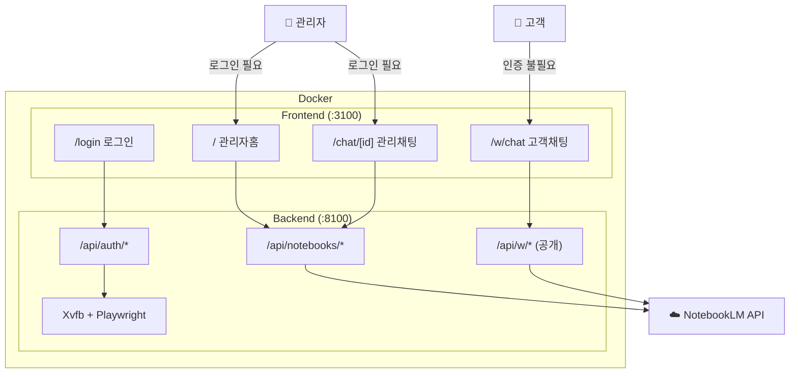
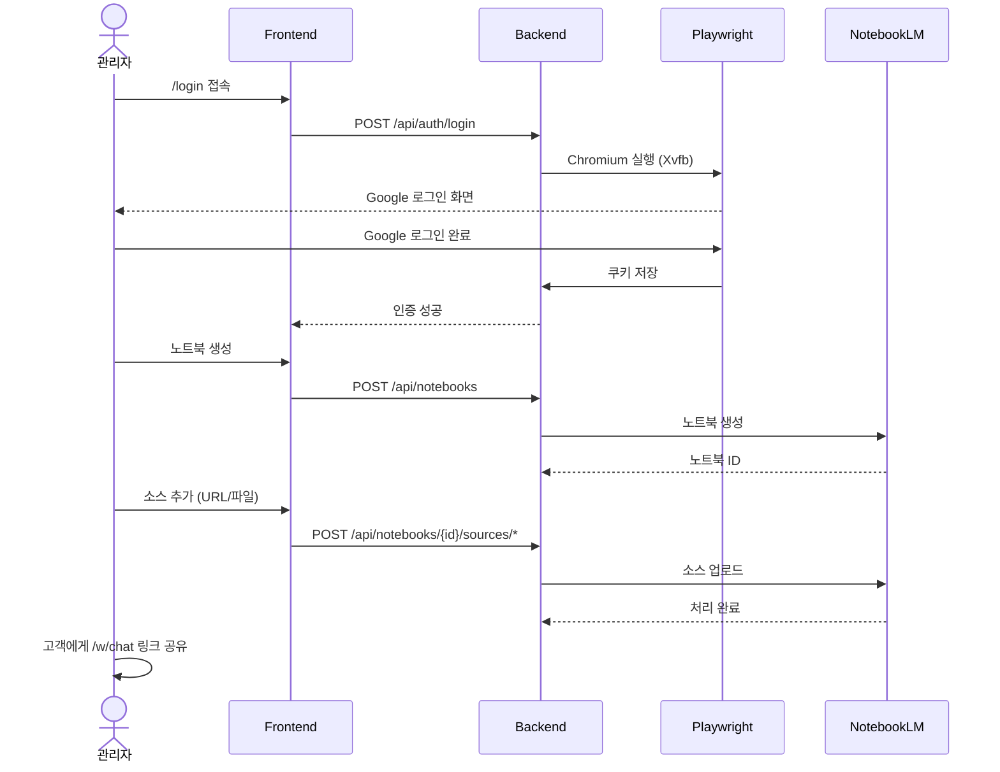
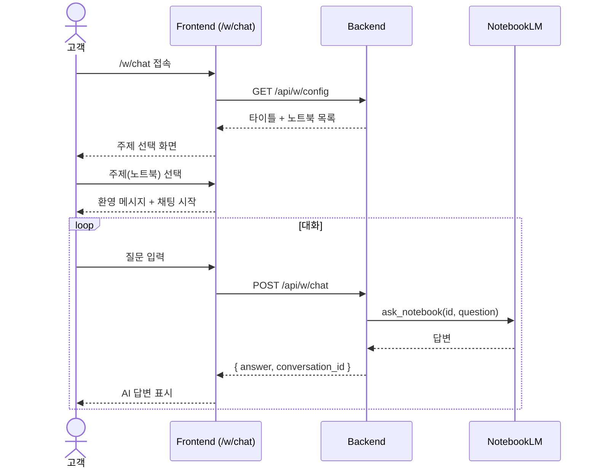

# NotebookLM 챗봇 서비스 가이드

## 서비스 구조



---

## 관리자 흐름



---

## 고객 흐름



---

## 페이지 목록

### 관리자 페이지 (로그인 필요)

| URL | 설명 |
|-----|------|
| `http://localhost:3100/` | 노트북 목록 (생성/삭제) |
| `http://localhost:3100/login` | Google 로그인 |
| `http://localhost:3100/chat/{노트북ID}` | 노트북 채팅 + 소스 관리 |

### 고객 페이지 (로그인 불필요)

| URL | 설명 |
|-----|------|
| `http://localhost:3100/w/chat` | 공개 채팅 (주제 선택 → 채팅) |

---

## 실행 방법

### Docker 실행 (권장)

```bash
cd notebooklm-chatbot
docker compose up -d --build
```

| 서비스 | URL |
|--------|-----|
| 프론트엔드 | http://localhost:3100 |
| 백엔드 API | http://localhost:8100 |
| API 문서 (Swagger) | http://localhost:8100/docs |

### 종료 / 로그 확인

```bash
docker compose down              # 종료
docker compose logs -f backend   # 백엔드 로그
docker compose logs -f frontend  # 프론트엔드 로그
```

---

## 환경변수

`docker-compose.yml` 또는 `.env` 파일에서 설정:

| 변수 | 기본값 | 설명 |
|------|--------|------|
| `WIDGET_TITLE` | `Support` | 고객 채팅 페이지 타이틀 |
| `WIDGET_WELCOME_MESSAGE` | `안녕하세요! 무엇을 도와드릴까요?` | 고객 채팅 첫 메시지 |

---

## API 엔드포인트

### 관리자 API (인증 필요)

| Method | Endpoint | 설명 |
|--------|----------|------|
| GET | `/api/auth/status` | 인증 상태 확인 |
| POST | `/api/auth/login` | 로그인 세션 시작 |
| GET | `/api/auth/login/poll` | 로그인 완료 폴링 |
| POST | `/api/auth/logout` | 로그아웃 |
| GET | `/api/notebooks` | 노트북 목록 |
| POST | `/api/notebooks` | 노트북 생성 |
| DELETE | `/api/notebooks/{id}` | 노트북 삭제 |
| GET | `/api/notebooks/{id}/sources` | 소스 목록 |
| POST | `/api/notebooks/{id}/sources/url` | URL 소스 추가 |
| POST | `/api/notebooks/{id}/sources/file` | 파일 소스 추가 |
| DELETE | `/api/notebooks/{id}/sources/{sid}` | 소스 삭제 |
| POST | `/api/notebooks/{id}/chat` | 관리자 채팅 |
| GET | `/api/notebooks/{id}/chat/history` | 채팅 히스토리 |

### 고객 API (인증 불필요)

| Method | Endpoint | 설명 |
|--------|----------|------|
| GET | `/api/w/config` | 위젯 설정 + 노트북 목록 |
| POST | `/api/w/chat` | 고객 채팅 (body: notebook_id, question, conversation_id?) |

---

## 참고사항

- **고객 채팅 히스토리**: 현재 브라우저 세션 내에서만 유지. 새로고침 시 리셋됨.
- **인증 쿠키**: Docker 볼륨 `notebooklm-auth`에 저장. 주기적으로 만료되므로 재로그인 필요.
- **NotebookLM 비공식 API**: Google 내부 API 변경 시 동작이 깨질 수 있음.
